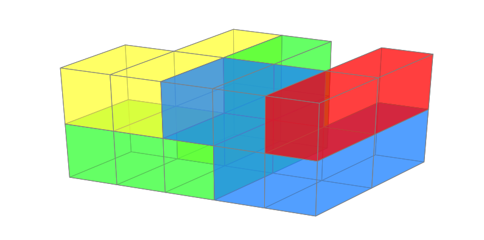
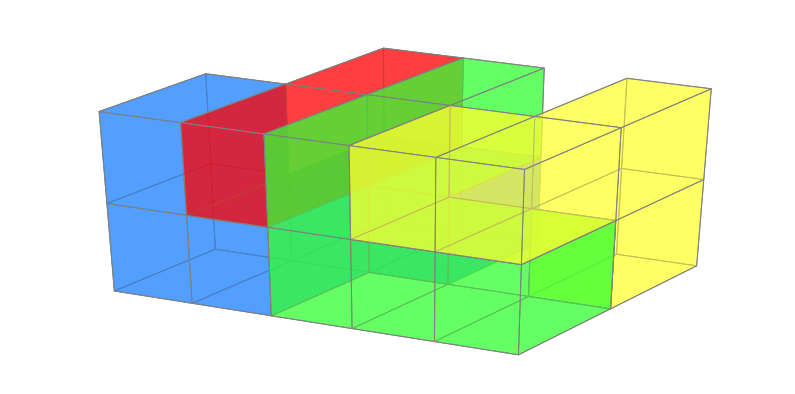

# Ubongo 3D family solver

This script solves a given **puzzle** with a set of **pieces**.

+ **Puzzles** are identified by their code (available in the bottom right of the Ubongo puzzle card), e.g., *4-24*.
+ **Pieces** are standard Ubongo 3D pieces identified by the combination of their *color* and *size*. For example, `b5` represents the *blue* piece that has a unit size of *5*.

## Solve a puzzle

To solve a puzzle, go to the <a href='#solver'>Ubongo 3D family solver</a> and provide:

+ `target_puzzle`: puzzle to solve
+ `target pieces`: list of standard Ubongo 3D pieces

    
E.g., 

```
target_puzzle = "4-24"
target_pieces = ['b5', 'g5', 'r2', 'y4']
```

Running `solve_puzzle` will produce the number of solutions, while `plot_solutions` will provide a simple graphical representation of each solution.

E.g.,





## Create your own puzzles

The script contains all puzzles from Ubongo 3D family.

To create your own puzzle, add a new data entry to `puzzle_coordinates` with the *(x,y)* unit coordinates of your puzzle defined as integer tuples. E.g., `(1,2)` sets a unit puzzle with coordinates `(x=1, y=2)`, where `(0,0)` is in the bottom left. The `PUZZLE_HEIGHT` defines the height of the puzzle, which in Ubongo 3D family is 2. This can be changed to 3 or 4. Beware, running time will be long enough so that you might want to solve it by yourself.

## Get all piece combinations for a given puzzle 

To get all piece combinations for a given puzzle, go to <a href='#finder'>Get all piece combinations for a given puzzle</a> and provide:

+ `target_puzzle`: puzzle to solve
    
E.g.,

```
target_puzzle = "4-24"
```

Running `find_all_solvable_piece_combinations` will look at each piece combination and will provide the following:
+ valid piece combination given the target puzzle, with the number of solutions of the piece combination
+ total number of solvable combinations
+ total number of valid combinations (where total number of piece unit sizes is exactly the unit size of the puzzle)

Thus you can check your own puzzle, or find valid piece combinations not depicted on the Ubongo cards.
Also, adjusting `PUZZLE_HEIGHT` it's possible to find piece combinations for puzzles of greater height. Again, it might take quite some time.   


## Disclaimer

This script is a weekend project for personal use only.
